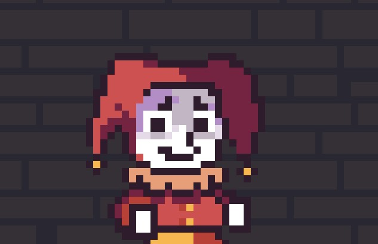

# Jest or Die

> The fool must please the highness if he wants to live! In "Jest or Die", you'll have the experience of a 2D platformer with frantic action, aiming to survive and make the king laugh.

> O bobo deve agradar a alteza caso queira viver! Em Jest or Die, você irá ter a experiência de um jogo de plataforma 2D de ação frenética, visando sobreviver e fazer o rei rir.

### Ajustes e melhorias

-   [x] MVP;
-   [x] Músicas;
-   [ ] Fases;
-   [ ] Save.

### Linguagens e Tecnologias

### Colaboradores

<table>
  <tr>
    <td align="center">
      <a href="https://github.com/romhenri">
         
        
          <b>Rômulo Henri</b>
        
      </a>
    </td>
        <td align="center">
      <a href="https://github.com/zoiudico">
         
        
          <b>Antônio Carlos</b>
        
      </a>
    </td>
    <td align="center">
      <a href="https://github.com/j4marcos">
         
        
          <b>João Marcos</b>
        
      </a>
    </td>
    <td align="center">
      <a href="https://github.com/NandoTavares">
         
        
          <b>Ernandes Tavares</b>
        
      </a>
    </td>
    <td align="center">
      <a href="https://github.com/luyluish ">
         
        
          <b>Luis HF Carvalho</b>
        
      </a>
    </td>
  </tr>
</table>